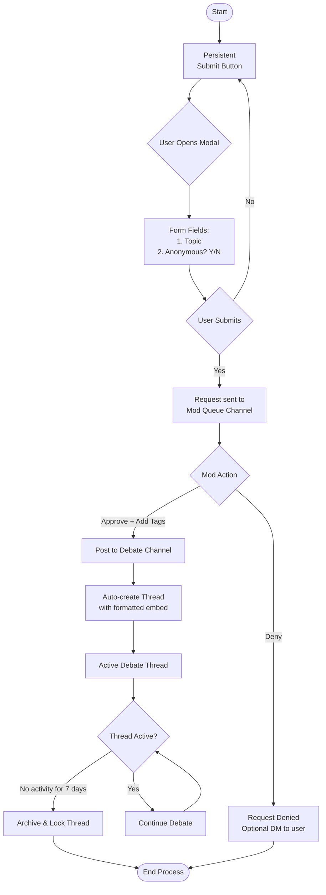

```mermaid

flowchart TD
    Start([Start]) --> Button[Persistent<br>Submit Button]
    
    Button --> Modal{User Opens Modal}
    
    Modal --> Form[Form Fields:<br>1. Topic<br>2. Anonymous? Y/N]
    
    Form --> Submit{User Submits}
    
    Submit -->|Yes| ModQueue[Request sent to<br>Mod Queue Channel]
    Submit -->|No| Button
    
    ModQueue --> ModAction{Mod Action}
    
    ModAction -->|Approve + Add Tags| DebateChannel[Post to Debate Channel]
    ModAction -->|Deny| Denied[Request Denied<br>Optional DM to user]
    
    DebateChannel --> CreateThread[Auto-create Thread<br>with formatted embed]
    
    CreateThread --> ActiveDebate[Active Debate Thread]
    
    ActiveDebate --> ActivityCheck{Thread Active?}
    
    ActivityCheck -->|Yes| Continue[Continue Debate]
    Continue --> ActivityCheck
    
    ActivityCheck -->|No activity for 7 days| Archive[Archive & Lock Thread]
    
    Archive --> End([End Process])
    
    Denied --> End

```